# ZooIntegration

## MQ-Sharp mapping and interactions (updated overview)
This section documents how the classes/interfaces in `MQ-Sharp/ZooKeeperIntegration/` interact with a ZooKeeper cluster in this repository.
It complements the legacy overview below and reflects the actual files present under `MQ-Sharp/ZooKeeperIntegration/`.

- __Code locations__
  - `IZooKeeperClient` → `MQ-Sharp/ZooKeeperIntegration/IZooKeeperClient.cs`
  - `IZooKeeperConnection` → `MQ-Sharp/ZooKeeperIntegration/IZooKeeperConnection.cs`
  - `ZooKeeperConnection` → `MQ-Sharp/ZooKeeperIntegration/ZooKeeperConnection.cs`
  - `ZooKeeperClient` (partial) →
    - `MQ-Sharp/ZooKeeperIntegration/ZooKeeperClient.cs` (lifecycle, event loop)
    - `MQ-Sharp/ZooKeeperIntegration/ZooKeeperClient.Watcher.cs` (watchers, subscriptions, Process)
    - `MQ-Sharp/ZooKeeperIntegration/ZooKeeperClient.Data.cs` (read/write data)
    - `MQ-Sharp/ZooKeeperIntegration/ZooKeeperClient.Node.cs` (create/delete nodes)
  - Events → `MQ-Sharp/ZooKeeperIntegration/Events/` (args types and handler containers)
  - Listeners → `MQ-Sharp/ZooKeeperIntegration/Listener/` (`BrokerTopicsListener`, `ZKRebalancerListener`, and listener interfaces)
  - Paths helper → `MQ-Sharp/ZooKeeperIntegration/ZkPaths.cs`

- __Key interfaces__
  - `IZooKeeperConnection` wraps the low-level `ZooKeeperNet.ZooKeeper` API, exposing:
    - Lifecycle: `Connect(IWatcher)`, `ClientState`, `Servers`, `SessionTimeout`.
    - CRUD/reads: `Create`, `Delete`, `Exists`, `GetChildren`, `ReadData`, `WriteData`, `GetCreateTime`.
  - `IZooKeeperClient` is the high-level client used by application code and listeners:
    - Lifecycle: `Connect()`, `Disconnect()`, `Reconnect(...)`, `GetClientState()`.
    - Gating/retries: `WaitUntilConnected(...)`, `RetryUntilConnected(...)`.
    - Subscriptions: `Subscribe/Unsubscribe` for state, child, and data listeners.
    - Watch helpers: `WatchForChilds(path)`, `WatchForData(path)`.
    - Node/data ops: `Exists`, `GetChildren`, `ReadData<T>`, `WriteData`, `Create*`, `Delete*`.

- __Concrete classes and responsibilities__
  - `ZooKeeperConnection` holds the underlying `ZooKeeper` instance, translates connection states to `KeeperState`, and performs IO. See `ZooKeeperConnection.Connect`, `Create`, `ReadData`, `WriteData`, `Exists`, `GetChildren`.
  - `ZooKeeperClient` manages:
    - Connection lifecycle and gating (`Connect`, `WaitUntilConnected`, `RetryUntilConnected`).
    - Watch registration and re-registration (`Subscribe`, `WatchForChilds`, `WatchForData`).
    - Event demultiplexing from ZooKeeper callback thread to an internal worker thread via a `ConcurrentQueue<ZooKeeperEventArgs>`.
    - Exposes a `ReaderWriterLockSlim` (`SlimLock`) and `IdleTime` for coordination/observability.

- __Listeners__ (under `Listener/`)
  - `BrokerTopicsListener` implements `IZooKeeperChildListener` for broker/topic tree changes. Methods are scaffolded; business logic is currently TODO.
  - `ZKRebalancerListener` implements `IZooKeeperChildListener` and provides the scaffolding for async rebalance (`AsyncRebalance`, cancellation, event). Core rebalance steps are TODO.
  - Listener interfaces: `IZooKeeperChildListener`, `IZooKeeperDataListener`, `IZooKeeperStateListener` define the callbacks that `ZooKeeperClient` will invoke when enqueuing events.

- __Event pipeline from ZooKeeper to your handlers__
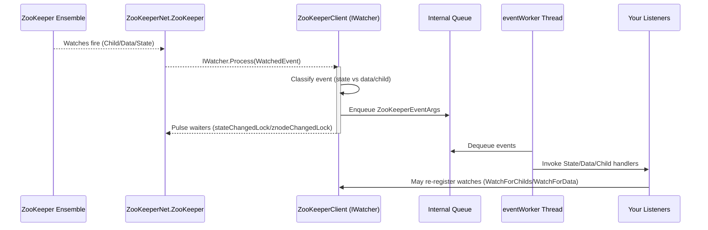

- __Connection lifecycle and retries__
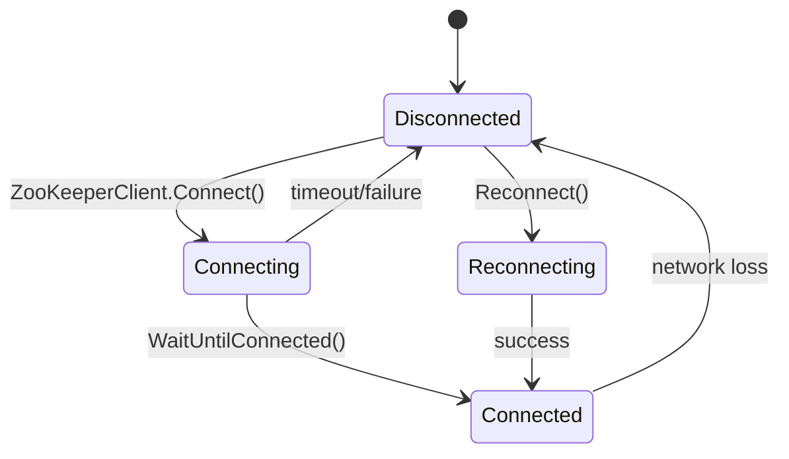

- __Watch semantics__
  - ZooKeeper watches are one-shot; re-register after each notification.
  - `WatchForChilds(path)` performs `Exists(path)` then `GetChildren(path)` (with watch) and returns the current children (or null if `NONODE`).
  - `WatchForData(path)` performs `Exists(path, true)` to set the data watch.

- __Current implementation notes__
  - In `ZooKeeperClient.Watcher.cs`, `ProcessStateChange(...)` and `ProcessDataOrChildChange(...)` are `NotImplementedException` placeholders. The event queueing, subscription bookkeeping, and pulsing logic are present, but handlers need completing to raise the right event args to subscribers.
  - In `Listener/BrokerTopicsListener.cs` and `Listener/ZKRebalancerListener.cs`, core handling bodies are TODO. The methods and locking structure are in place; fill these to enact your desired coordination logic.

- __Class relations__
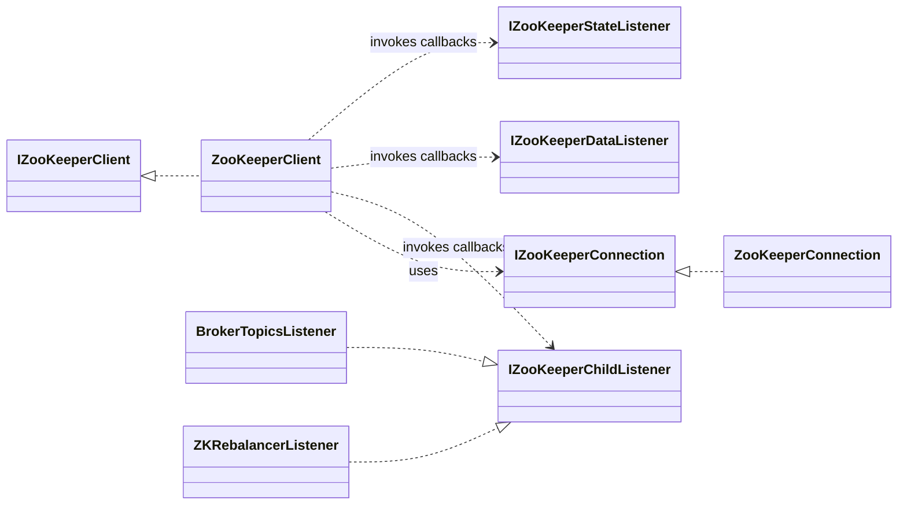

- __Minimal usage example__
```csharp
var conn = new ZooKeeperConnection("zk1:2181,zk2:2181", 30000);
var client = new ZooKeeperClient(); // assuming constructor wires `conn` and serializer
client.Connect();
if (!client.WaitUntilConnected(10000)) throw new Exception("ZK connect timeout");

client.Subscribe("/brokers/ids", new BrokerTopicsListener(client, brokerTopicMap, brokerIdMap, OnNewBroker));
var children = client.WatchForChilds("/brokers/ids");

client.CreateEphemeral("/consumers/my-group/ids/c1");
client.WriteData("/config/my-app", new { enabled = true });
var cfg = client.ReadData<string>("/config/my-app");
```

## Title & Abstract
The `KafkaNET.Library.ZooKeeperIntegration` module provides the ZooKeeper-backed discovery, coordination, and rebalancing layer for the legacy Kafka 0.8 .NET client. It abstracts ZooKeeper connection handling, watch registration, and event delivery, and implements concrete listeners that translate ZooKeeper changes into consumer/producer topology updates. Use this integration when you need deterministic consumer group coordination, partition ownership, and broker/topic metadata driven by ZooKeeper. The listeners covered here implement broker discovery, partition leader tracking, group rebalancing, and session lifecycle handling.

## Module Overview
- The module centers on `ZooKeeperClient` (high-level client, watcher and subscription management) and `ZooKeeperConnection` (low-level connection and IO to the ensemble).
- Concrete listeners under `KafkaNET.Library/ZooKeeperIntegration/Listeners/` subscribe to child/data/state events and react by updating registries, rebalancing consumers, and rewiring fetchers.
- Watchers are one-shot in ZooKeeper; `ZooKeeperClient` re-registers watches and multiplexes callbacks to listeners via internal queues/threads.

### Roles
- `ZooKeeperClient` (`KafkaNET.Library/ZooKeeperIntegration/ZooKeeperClient.cs`, `ZooKeeperClient.Watcher.cs`)
    - Owns watch registration APIs (`Subscribe`), event demultiplexing, re-registration (`WatchForChilds`, `WatchForData`), and a background event worker thread.
    - Exposes high-level constants for paths: `DefaultConsumersPath`, `DefaultBrokerIdsPath`, `DefaultBrokerTopicsPath`.
    - Provides retry wrappers (`RetryUntilConnected`) and exposes `SlimLock` for critical sections around ZK writes.
- `ZooKeeperConnection` (`KafkaNET.Library/ZooKeeperIntegration/ZooKeeperConnection.cs`)
    - Wraps the underlying `ZooKeeperNet.ZooKeeper` client.
    - Manages the concrete connection lifecycle (`Connect`, `Dispose`), session timeout, and maps raw `ZooKeeper.States` to `KeeperState`.

### Watcher semantics
- ZooKeeper watchers are edge-triggered and one-shot. After a notification, the watch must be re-registered.
- `ZooKeeperClient` re-installs watches in:
    - `WatchForChilds(path)` → `Exists(path)` then `GetChildren(path)` with watch.
    - `WatchForData(path)` → `Exists(path, true)`.
- On session expiration (`KeeperState.Expired`), `ZooKeeperClient.Process()` enqueues synthetic change events for all registered paths to drive re-synchronization.
- Ephemeral nodes are used for partition ownership; they vanish on session expiration and must be re-created.

### Architecture Diagram
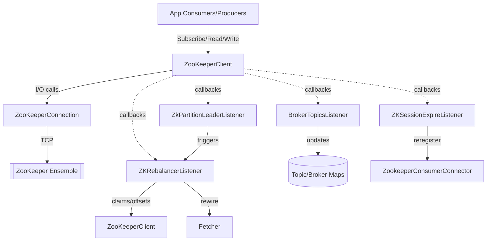

## Cross-Cutting Concepts
- __Threading__
    - `ZooKeeperClient` runs:
        - ZooKeeper event thread (from `ZooKeeperNet`) invoking `ZooKeeperClient.Process()`.
        - An internal `eventWorker` thread pumping a queue (`ConcurrentQueue<ZooKeeperEventArgs>`, see `ZooKeeperClient.Watcher.cs`).
    - Listeners:
        - `ZKRebalancerListener<TData>` uses `asyncLock` for starting/stopping asynchronous rebalance and `syncLock` to serialize `SyncedRebalance()`.
        - `BrokerTopicsListener` uses a private `syncLock` in `HandleChildChange()`.
        - `ZKRebalancerListener<TData>` uses `zkClient.SlimLock` (a `ReaderWriterLockSlim`) for ephemeral ZK writes.
- __Retries/backoff/timeouts__
    - `ZooKeeperClient.RetryUntilConnected` retries on `KeeperException.Code.CONNECTIONLOSS` and `SESSIONEXPIRED` with waits up to `connectionTimeout * 4`.
    - `ZKRebalancerListener` sleeps `config.ConsumeGroupRebalanceRetryIntervalMs` after catch-all exceptions and loops until success or canceled.
    - Partition claim retry loop sleeps 1s between attempts.
- __Error taxonomy and recovery__
    - Handles ZK codes: `CONNECTIONLOSS`, `SESSIONEXPIRED`, `NONODE`, `NODEEXISTS`, `OPERATIONTIMEOUT`.
    - On connection loss/expire, client waits for reconnection and re-registers watches; on expire, listeners rebuild state and re-register consumers.
- __Idempotency and ordering__
    - Listeners guard state with locks; `ZKRebalancerListener` cancels in-progress rebalances before starting new ones to avoid reentrancy.
    - Ephemeral partition ownership claims are retried; ownership reflection is idempotent, conflict (`NODEEXISTS`) triggers wait-and-retry.
- __Metrics & logging__
    - Logging via `log4net`. Levels:
        - `Info` for lifecycle events (rebalances, leader changes, session events).
        - `Debug` for detailed path changes and ZK operations.
        - `Error/Warn` for failures, retries, and exception traces.
    - No built-in metrics; external instrumentation can hook into `ConsumerRebalance`, `ZKSessionDisconnected`, `ZKSessionExpired` events for counters.

## Listeners Deep Dive

### BrokerTopicsListener
File: `KafkaNET.Library/ZooKeeperIntegration/Listeners/BrokerTopicsListener.cs`

- __Purpose & Triggers__
    - Watches:
        - `ZooKeeperClient.DefaultBrokerTopicsPath` = `/brokers/topics` (children)
        - `/brokers/topics/<topic>` (children)
        - `ZooKeeperClient.DefaultBrokerIdsPath` = `/brokers/ids` (children)
    - Triggered by child changes; updates in-memory broker maps and invokes a callback on broker additions.
- __Owned State__
  | Field | Type | Responsibility / Invariant |
  |---|---|---|
  | `actualBrokerIdMap` | `IDictionary<int,Broker>` | Live broker ID → `Broker` map. Keys reflect `/brokers/ids/*`. |
  | `actualBrokerTopicsPartitionsMap` | `IDictionary<string, SortedSet<Partition>>` | Topic → partitions mapping discovered from `/brokers/topics/<topic>`. May be null-initialized per topic. |
  | `oldBrokerIdMap` | `IDictionary<int,Broker>` | Last-seen snapshot for diff; updated at end of `HandleChildChange`. |
  | `oldBrokerTopicsPartitionsMap` | `IDictionary<string, SortedSet<Partition>>` | Last-seen topic map snapshot; used to compute new topics. |
  | `callback` | `Action<int,string,int>` | Invoked on new broker registration: `(brokerId, host, port)`. |
  | `syncLock` | `object` | Serializes `HandleChildChange()` execution. |
- __Public & Internal APIs__
  | Method | Thread | Description |
  |---|---|---|
  | `HandleChildChange(ZooKeeperChildChangedEventArgs e)` | ZK event worker path via `ZooKeeperClient` | Switch on `e.Path`: recompute new topics, subscribe to per-topic children, and process broker changes. Updates snapshots. |
  | `ResetState()` | App thread | Copies actual maps into old snapshots; logs current state. |
  | `ProcessNewBrokerInExistingTopic(string topic, IEnumerable<string> childs)` | Internal | Builds updated partitions per broker by reading `/brokers/topics/<topic>/<brokerId>`. Merges with existing map. Note: partition population is currently commented out in code. |
  | `ProcessBrokerChange(string path, IEnumerable<string> childs)` | Internal | Diffs `/brokers/ids/*`. Adds new brokers by reading `/brokers/ids/<id>` host:port; removes dead ones; purges from topic maps (removal code commented). Invokes `callback` for new brokers. |
- __Interaction Diagram__
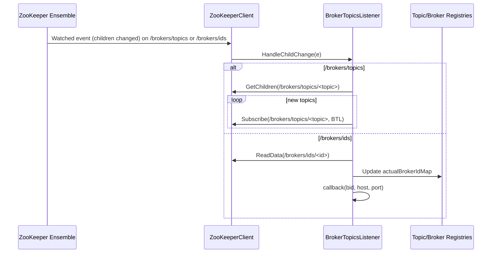
- __Concurrency & Ordering__
    - Single-threaded handler via `lock (syncLock)`.
    - Assumes `HandleChildChange` is re-entrant-safe; uses snapshots (`old*`) to compute diffs.
- __Failure & Recovery__
    - Catches all exceptions in handler to avoid killing event loop; logs at `Debug`.
    - Topic partition construction partially disabled (commented) — Inference: library evolved to use alternative partition metadata (e.g., via `ZkUtils`).
- __Configuration knobs__
    - ZK paths via `ZooKeeperClient.DefaultBrokerTopicsPath` and `DefaultBrokerIdsPath`.
- __Design Rationale__
    - Encapsulates broker/topic child watches independent of consumer logic. Updates shared registries and notifies via callback.
- __Mini Reference__
    - `HandleChildChange(...)` — switch on path, subscribe and update maps.
    - `ProcessBrokerChange(...)` — read broker host/port and update/remove brokers.
    - `ProcessNewBrokerInExistingTopic(...)` — per-topic broker-partitions discovery.

### ZkPartitionLeaderListener<TData>
File: `KafkaNET.Library/ZooKeeperIntegration/Listeners/ZkPartitionLeaderListener.cs`

- __Purpose & Triggers__
    - Watches leader/ISR data nodes per partition (data changes).
    - Triggered by data change or delete; determines if repartitioning is needed.
- __Owned State__
  | Field | Type | Responsibility / Invariant |
  |---|---|---|
  | `_rebalancer` | `ZKRebalancerListener<TData>` | Target for triggering a rebalance. |
  | `_partitionLeaderMap` | `Dictionary<string,int>` | Path → last-known leader brokerId; only triggers when value changes. |
- __Public & Internal APIs__
  | Method | Thread | Description |
  |---|---|---|
  | `HandleDataChange(ZooKeeperDataChangedEventArgs args)` | ZK event worker path | Parses leader via `ZkUtils.TryParsePartitionLeader(args.Data)`. If path unknown or changed, update map and call `_rebalancer.AsyncRebalance()`. |
  | `HandleDataDelete(ZooKeeperDataChangedEventArgs args)` | ZK event worker path | Calls `_rebalancer.AsyncRebalance()` on delete. |
- __Interaction Diagram__
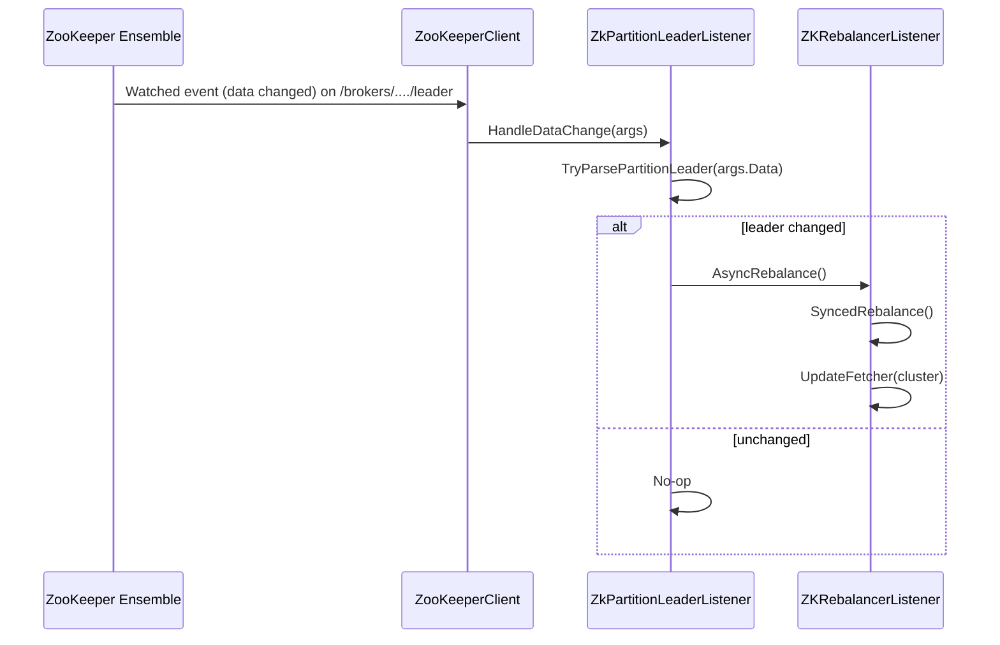
- __Concurrency & Ordering__
    - Stateless other than a per-path cache; no explicit locks, benign races due to idempotent `AsyncRebalance()`.
- __Failure & Recovery__
    - Logs parsing failure and skips rebalance; delete always triggers rebalance.
- __Configuration__
    - None directly; inherits rebalance behavior from `ZKRebalancerListener`.
- __Design Rationale__
    - Minimal coupling: pushes changes to a rebalance actor rather than performing assignments directly.
- __Mini Reference__
    - `HandleDataChange(...)` — detect leader changes and trigger rebalance.
    - `HandleDataDelete(...)` — trigger rebalance on leader disappearance.

### ZKRebalancerListener<TData>
File: `KafkaNET.Library/ZooKeeperIntegration/Listeners/ZKRebalancerListener.cs`

- __Purpose & Triggers__
    - Watches consumer group membership and brokers for topology changes; executes partition assignment, ownership via ephemeral znodes, and fetcher rewiring.
    - Triggered by:
        - Child changes on group-related paths (see subscription in connector; `HandleChildChange` calls `AsyncRebalance`).
        - Explicit calls from leader listener and session listeners.
- __Owned State__
  | Field | Type | Responsibility / Invariant |
  |---|---|---|
  | `oldPartitionsPerTopicMap` | `IDictionary<string,IList<string>>` | Older snapshot; currently cleared on reset. |
  | `oldConsumersPerTopicMap` | `IDictionary<string,IList<string>>` | Older snapshot; currently cleared on reset. |
  | `topicRegistry` | `IDictionary<string, IDictionary<int, PartitionTopicInfo>>` | Topic → PartitionId → info owned by this consumer. |
  | `queues` | `IDictionary<Tuple<string,string>, BlockingCollection<FetchedDataChunk>>` | Per topic/thread queues. |
  | `consumerIdString` | `string` | Consumer identity. |
  | `syncLock` | `object` | Serializes `SyncedRebalance`. |
  | `asyncLock` | `object` | Serializes starting/stopping async rebalance. |
  | `config` | `ConsumerConfiguration` | Rebalance intervals, fetch settings, autocommit. |
  | `zkClient` | `IZooKeeperClient` | ZK access; uses `SlimLock` for ephemeral writes. |
  | `dirs` | `ZKGroupDirs` | Path helper for group. |
  | `fetcher` | `Fetcher` | Fetching worker to shutdown/init. |
  | `zkConsumerConnector` | `ZookeeperConsumerConnector` | Interacts for ownership release/commit/register. |
  | `kafkaMessageStreams` | `IDictionary<string,IList<KafkaMessageStream<TData>>>` | For clearing queues. |
  | `topicCount` | `TopicCount` | Desired topic subscriptions for this consumer. |
  | `rebalanceCancellationTokenSource` | `CancellationTokenSource` | Cancel in-flight rebalance. |
  | `isRebalanceRunning` | `volatile bool` | Signals rebalance activity; polled by waiters. |
- __Public & Internal APIs__
  | Method | Thread | Description |
  |---|---|---|
  | `HandleChildChange(ZooKeeperChildChangedEventArgs args)` | ZK event worker path | Logs and calls `AsyncRebalance()`. |
  | `ResetState()` | App/ZK state handler | `SlimLock.WriteLock` to clear `topicRegistry`; clears old maps. |
  | `AsyncRebalance(int waitTimeoutMs=0)` | App/ZK callback | Stops current (`StopRebalance()`), starts background task `SyncedRebalance()`, optional wait with timeout. |
  | `StopRebalance()` | App | Cancels and waits for `isRebalanceRunning` false; resets token. |
  | `ShutdownFetchers()` | App/ZK state handler | Shutdowns fetcher and marks offsets invalid in `topicRegistry`. |
  | `SyncedRebalance(CancellationTokenSource)` | Task thread | Main rebalance loop: notify `ConsumerRebalance` event, fetch cluster via `Cluster(zkClient)`, call `Rebalance()`, retry on error or until canceled. |
  | `Rebalance(Cluster, CancellationTokenSource)` | Task thread | Compute assignments, close fetchers, release ownership, claim partitions with ephemeral nodes, update fetcher. |
  | `ProcessPartition(...)` | Task thread | Per-partition claim loop: if unowned or owned-by-self, add info and `ReflectPartitionOwnershipDecision`; else sleep and retry (honor cancellation). |
  | `ReflectPartitionOwnershipDecision(...)` | Task thread | Create ephemeral path via `ZkUtils.CreateEphemeralPathExpectConflict` within `zkClient.SlimLock` write lock; handle `NODEEXISTS`. |
  | `AddPartitionTopicInfo(...)` | Task thread | Resolve leader via `ZkUtils.GetLeaderForPartition`, read committed offset, create `PartitionTopicInfo`, attach to `topicRegistry`. |
  | `ReleasePartitionOwnership(...)` | Task thread | `ZookeeperConsumerConnector.ReleaseAllPartitionOwnerships()`, remove topics from registry. |
  | `UpdateFetcher(Cluster)` | Task thread | Initialize fetcher connections for selected partitions. |
  | Events: `ConsumerRebalance` | App | Notifies listeners that a rebalance cycle begins. |
- __Interaction Diagram__
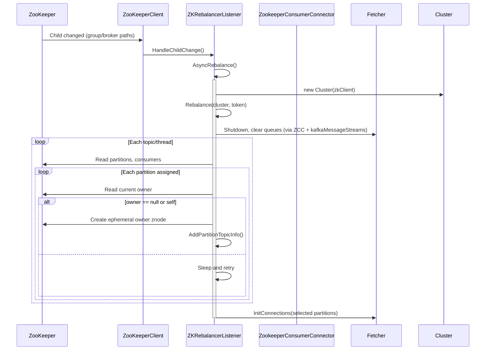
- __Concurrency & Ordering__
    - `asyncLock` prevents concurrent starts; `syncLock` ensures single active rebalance critical section.
    - Cancellation token breaks long loops; `StopRebalance` waits until completion.
    - `ReaderWriterLockSlim` on `zkClient.SlimLock` protects ZK ephemeral writes (conflicts across threads).
- __Failure & Recovery__
    - If no brokers found: subscribes to `/brokers/ids` and returns false to retry later.
    - On exceptions: logs, sleeps `ConsumeGroupRebalanceRetryIntervalMs`, retries.
    - On `NODEEXISTS` during ownership: waits for delete and retries.
    - On `ObjectDisposedException`: cancels and exits.
- __Configuration knobs__
    - `ConsumerConfiguration.ConsumeGroupRebalanceRetryIntervalMs`
    - `ConsumerConfiguration.AutoCommit`, `FetchSize`
    - Subscriptions via `TopicCount` from ZK (`GetTopicCount`), consumer registry/offset dirs from `ZKGroupDirs/ZKGroupTopicDirs`.
- __Design Rationale__
    - Explicit separation of trigger (`HandleChildChange`, leader/session listeners) from heavy operation (`SyncedRebalance`) to avoid ZK callback thread blocking.
    - Dependency inversion: uses `IZooKeeperClient`, `ZookeeperConsumerConnector`, `Fetcher`, and `Cluster` abstractions.
- __Mini Reference__
    - `HandleChildChange(...)` — trigger async rebalance.
    - `AsyncRebalance(...)` — manage lifecycle of background rebalance.
    - `Rebalance(...)` — compute and apply assignment; claim ownership.
    - `ReflectPartitionOwnershipDecision(...)` — ephemeral create with conflict handling.

### ZKSessionExpireListener<TData>
File: `KafkaNET.Library/ZooKeeperIntegration/Listeners/ZKSessionExpireListener.cs`

- __Purpose & Triggers__
    - Watches ZooKeeper connection state and session lifecycle.
    - On disconnect/reconnect/expire, coordinates fetcher shutdown, consumer re-registration, and rebalance.
- __Owned State__
  | Field | Type | Responsibility |
  |---|---|---|
  | `consumerIdString` | `string` | Identity used for logs and registration. |
  | `loadBalancerListener` | `ZKRebalancerListener<TData>` | Target for `ShutdownFetchers`, `ResetState`, `AsyncRebalance`. |
  | `zkConsumerConnector` | `ZookeeperConsumerConnector` | Performs `RegisterConsumerInZk`. |
  | `dirs` | `ZKGroupDirs` | Group paths for registration. |
  | `topicCount` | `TopicCount` | Subscription definition for registration. |
  | Events: `ZKSessionDisconnected`, `ZKSessionExpired` | `EventHandler` | External observability hooks. |
- __Public & Internal APIs__
  | Method | Thread | Description |
  |---|---|---|
  | `HandleStateChanged(ZooKeeperStateChangedEventArgs args)` | ZK event worker path | If state is not `KeeperState.Disconnected`, logs "disconnected", raises `ZKSessionDisconnected`, and `ShutdownFetchers()`. If `SyncConnected`, triggers `AsyncRebalance()`. Note: logic is slightly counterintuitive; see note below. |
  | `HandleSessionCreated(ZooKeeperSessionCreatedEventArgs args)` | ZK event worker path | Raises `ZKSessionExpired`, calls `ResetState()`, `RegisterConsumerInZk(...)`, then `AsyncRebalance()`. |
  | `OnZKSessionDisconnected`, `OnZKSessionExpired` | App | Event invokers with exception guards. |
- __Concurrency & Ordering__
    - Stateless except for events; delegates to `ZKRebalancerListener` which handles concurrency.
- __Failure & Recovery__
    - On session created after expiration, re-registers ephemeral consumer node and forces a full rebalance.
- __Configuration__
    - Inherits group paths from `ZKGroupDirs`, consumer registration content from `TopicCount`.
- __Design Rationale__
    - Keep session handling separate; side-effect strictly through `ZKRebalancerListener` and `ZookeeperConsumerConnector`.
- __Note on `HandleStateChanged` logic__
    - Code path:
        - `if (args.State != KeeperState.Disconnected)` → log "disconnected" and shutdown fetchers.
        - `else if (args.State == KeeperState.SyncConnected)` → rebalance.
    - This appears inverted; typical intent is to shutdown on `Disconnected` and kick rebalance on `SyncConnected`. Treat current implementation behavior as source-of-truth.

## Deep Dive: ZooKeeperClient and ZooKeeperConnection

### Responsibilities split
- `ZooKeeperConnection`
    - Owns `ZooKeeper _zkclient` and session timeout.
    - Maps `ZooKeeper.States` to `KeeperState` for client code.
    - Performs the raw calls: `Exists`, `GetChildren`, `GetData`, `SetData`, `Create`, `Delete`.
- `ZooKeeperClient`
    - High-level connect/reconnect (`Connect`, `Disconnect`, `Reconnect`), with `WaitUntilConnected`.
    - Watch registration and re-registration:
        - `Subscribe(path, IZooKeeperChildListener)`
        - `Subscribe(path, IZooKeeperDataListener)`
        - `Subscribe(IZooKeeperStateListener)`
        - `WatchForChilds(path)` and `WatchForData(path)`
    - Event processing pipeline:
        - `Process(WatchedEvent e)` distinguishes state vs data/child and enqueues events; pulses condition variables.
        - On `Expired`, enqueues synthetic `ZooKeeperChildChangedEventArgs` and `ZooKeeperDataChangedEventArgs` for all registered paths.
    - Retry policies via `RetryUntilConnected` overloads.

### Lifecycle & State Machine (Connection)
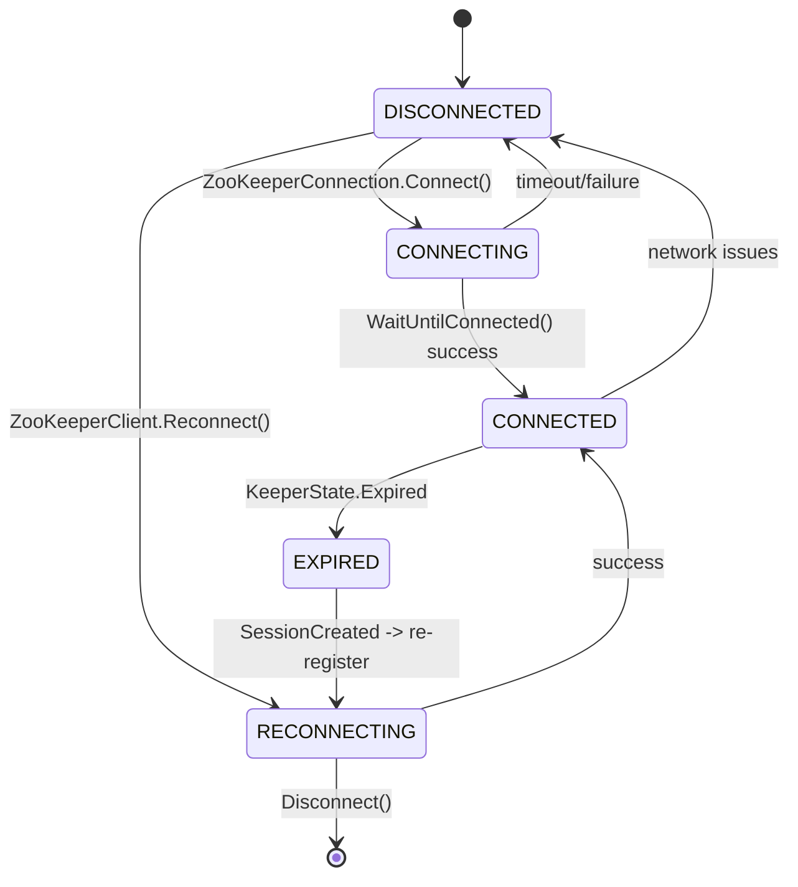

### Watch Re-registration Strategy
- `WatchForChilds` calls `Exists(path)` then `GetChildren(path)` capturing watch.
- `WatchForData` calls `Exists(path, true)`.
- On `Expired`, `Process()` enqueues synthetic events per registered path; listeners handle by re-reading current state and re-subscribing through `Subscribe(...)` pathways.

### Use-case Catalog
- List children with watch: `WatchForChilds(path)` → returns children or `null` if `NONODE`.
- Get data with watch: `ReadData<T>(path, watch: true)` via `ZooKeeperClient.ReadData<T>()` (generic overload in codebase).
- Exists with watch: `Exists(path, true)`.
- Create ephemeral: via `ZkUtils.CreateEphemeralPathExpectConflict(zkClient, path, data)` used in `ZKRebalancerListener.ReflectPartitionOwnershipDecision`.
- Caveats:
    - One-shot watches: always re-register after handling.
    - `ZooKeeperConnection.Exists(path, watch)` currently hardcodes `true` in underlying call; behavior is watch-always for exists checks.

### Backpressure & Fairness
- `ZooKeeperClient` uses a `ConcurrentQueue<ZooKeeperEventArgs>` and background `eventWorker` to decouple ZooKeeper callback thread from user listeners; avoids long-running work on the IO thread.
- `ZKRebalancerListener` performs heavy work in a `Task` and uses a cancellation token to ensure newer events preempt older work.

### Rationale: why the split exists
- Testability: `IZooKeeperConnection` and `IZooKeeperClient` interfaces decouple high-level logic from `ZooKeeperNet`.
- Failure domain isolation: connection-level errors are translated and retried in `ZooKeeperClient`, while application logic remains in listeners.

## End-to-End Flows (Mermaid sequences)

### Broker Topics Change → Partition Map Refresh (BrokerTopicsListener)
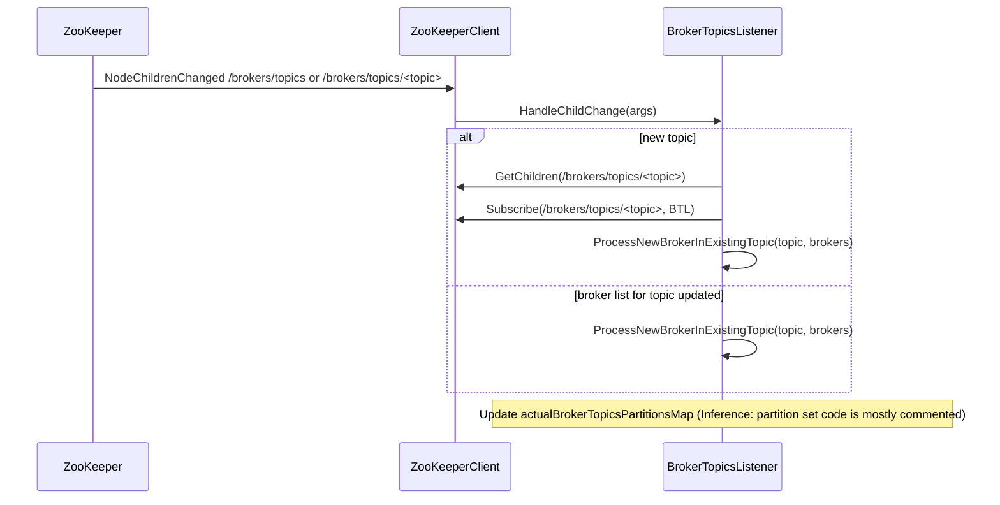

### Partition Leader Change → Fetcher Rewire (ZkPartitionLeaderListener)
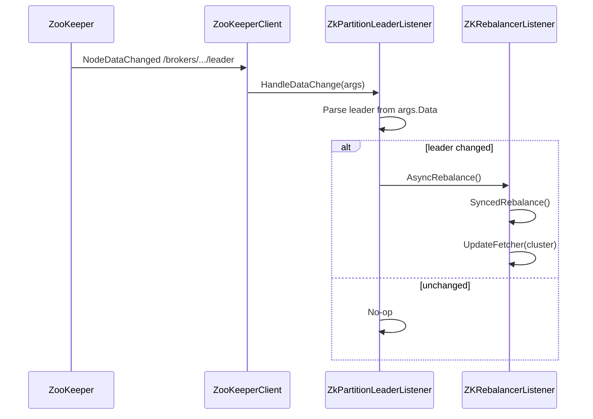

### Consumer Rebalance → Queue/Partition Reassignment (ZKRebalancerListener)
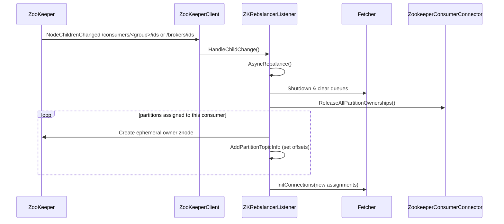

### Session Expiration → Full Rebuild (ZKSessionExpireListener)
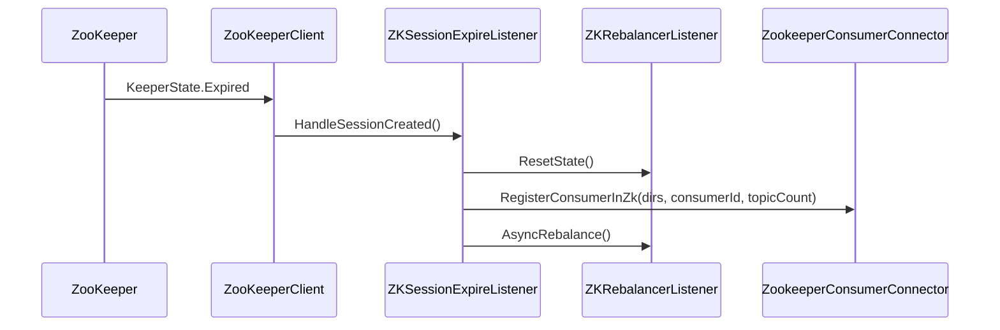

## Operational Guidance
- __Tuning__
    - Prefer watches with `Subscribe` calls over polling; the client already re-registers.
    - Increase `ConsumeGroupRebalanceRetryIntervalMs` if cluster is chatty to avoid thrashing; add jitter at orchestration layer if needed.
- __Safe restart / rolling update__
    - Consumers: stop fetchers first, then close; on restart, session reconnection and consumer registration will trigger rebalance automatically.
    - Handle ZK outages by letting `RetryUntilConnected` backoff; avoid tight loops on application thread.
- __Common pitfalls__
    - Missed watches: rely on client’s re-registration and synthetic events after `Expired`.
    - Thundering herd: ensure consumers apply backoff; ephemeral conflicts (`NODEEXISTS`) are handled by wait-and-retry.
    - Duplicate callbacks: listeners use locks and idempotent checks (e.g., leader cache) to avoid redundant rebalances.

## Testing Strategy
- __Unit tests per listener__
    - BrokerTopicsListener: diffing logic across `old*` and current children; callback invocation for new brokers.
    - ZkPartitionLeaderListener: leader parse success/failure; unchanged vs changed leader paths; delete events.
    - ZKRebalancerListener: cancellation preemption; `ReflectPartitionOwnershipDecision` `NODEEXISTS` path; empty brokers case; assignment math.
    - ZKSessionExpireListener: state transitions invoke correct `ShutdownFetchers`, `ResetState`, `RegisterConsumerInZk`, `AsyncRebalance`.
- __Integration tests with embedded ZK__
    - Simulate broker id churn under `/brokers/ids`.
    - Change leader nodes and ensure fetcher rewires.
    - Kill session to test expiration and full rebuild.
    - Network partitions to trigger `CONNECTIONLOSS`.
- __Determinism__
    - Seed timing-sensitive sleeps; bound wait timeouts; mock `ZkUtils` responses for assignment sets.

## Appendix

### Glossary
- Session: Client session with ZooKeeper; controls ephemeral node lifetime.
- Ephemeral node: Znode tied to session; removed when session ends.
- Watcher: One-shot callback on a ZK path for child/data/state changes.
- zxid: ZooKeeper transaction id; total order across ensemble.
- Versioning: ZNode version used for CAS updates (not directly used in shown code).

### Path layout (observed)
- Brokers
    - `/brokers/ids/<brokerId>` → "host:port"
    - `/brokers/topics/<topic>/<brokerId>` → string partition count (legacy)
- Consumers
    - `/consumers/<group>/ids/<consumerId>` → JSON `TopicCount`
    - `/consumers/<group>/owners/<topic>/<partition>` → ephemeral owner znode with `consumerThreadId`
    - `/consumers/<group>/offsets/<topic>/<partition>` → last committed offset
- Group dirs helpers
    - `ZKGroupDirs`, `ZKGroupTopicDirs` generate `ConsumerRegistryDir`, `ConsumerOwnerDir`, `ConsumerOffsetDir`.

### Reference: important error codes
- `KeeperException.Code.CONNECTIONLOSS`
- `KeeperException.Code.SESSIONEXPIRED`
- `KeeperException.Code.NONODE`
- `KeeperException.Code.NODEEXISTS`
- `KeeperException.Code.OPERATIONTIMEOUT`

## Mermaid Diagrams (must include)

### Architecture (graph TD)
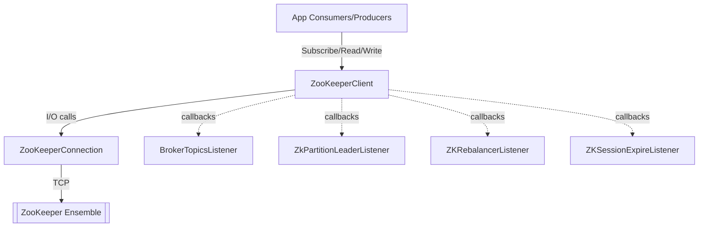

### State Machine (ZooKeeperConnection)
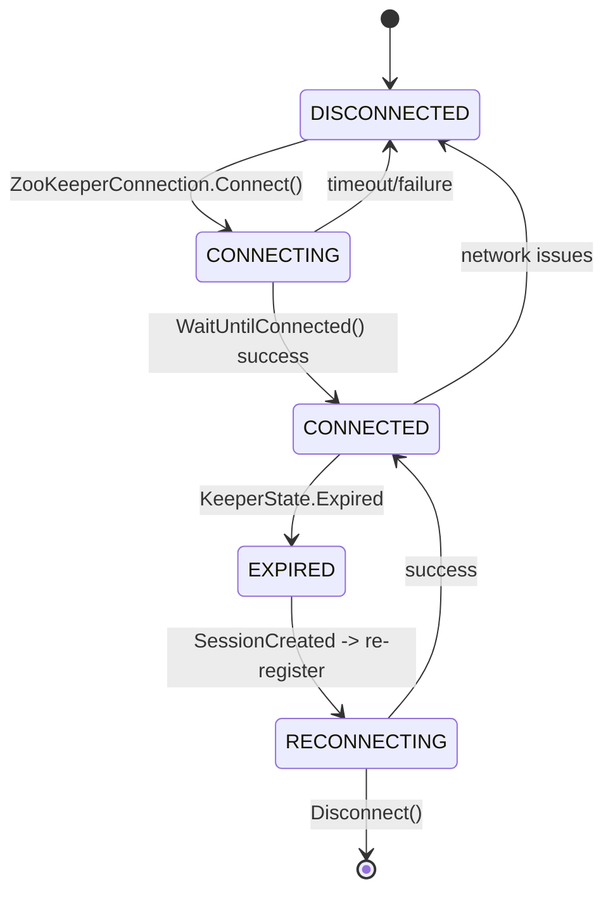

### Sequences
- Broker Topics Change → Partition Map Refresh: see above.
- Partition Leader Change → Fetcher Rewire: see above.
- Consumer Rebalance → Queue/Partition Reassignment: see above.
- Session Expiration → Full Rebuild: see above.

### Class Diagram (listeners and collaborators)
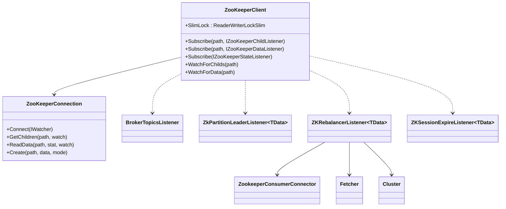

```
